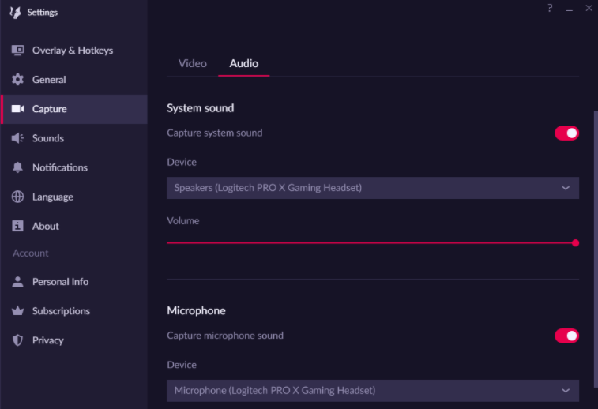

This log is not an Overwolf log but one found on any Windows computer. DxDiag is a diagnostics tool used to test DirectX functionality and troubleshoot video- or sound-related hardware problems. 

#### In the DxDiag log it is important to check the following:

* OS and build- Make sure that the user is up to date
* Processor- Make sure they meet the [Overwolf Minimum Requirements](https://support.overwolf.com/en/support/solutions/articles/9000177155-general-issues-and-solutions#minimum) 
* Memory and available OS memory
* User and system DPI settings- If the DPI setting on their system is over 100% (mostly for 4K monitors) send them our guide for [Scaling Overwolf Apps](https://support.overwolf.com/en/support/solutions/articles/9000176964-scaling-overwolf-apps-to-appear-properly-with-a-high-dpi-setting) to Appear Properly with a High DPI Setting

#### When investigating recording issues check:

* The Display device card name and driver version version- Make sure it meets the [Overwolf Recording Minimum Requirements](https://support.overwolf.com/en/support/solutions/articles/9000178267-overwolf-recording-minimum-requirements)

* Sound devices- Make sure that the sound devices are the same ones set in the Overwolf Settings



#### Request the log from users

The DxDiag file is usually automatically added to the Overwolf log. However, at times you may need to request that users send it manually.

You can use the following canned comment to request this from your users:

You can extract this info by doing the following:
 
1. Press the Windows key + R
2. Type dxdiag and click on OK. The "DirectX Diagnostic Tool" window should pop up.
3. In the new window choose "Save all information".
4. After you save the file, please attach it to your reply here.

Video guide: https://www.hippovideo.io/video/play/VUI7E8-cy7fMzGG30VeRPg==

#### Find the same info in other logs

In the Trace logs you can find the OS and display Device:

```
(INFO) (UI) LoginSession - Initializing Login Session (Windows 10 64-bit, .NET 4.8, 10.0.19041.804) (INFO) [ 9] <>c - Override GPU Info with dxdiag (Intel (R)  UHD Graphics, NVIDIA GeForce GTX 1650 Ti, ] -> [Inter (R)  UHD Graphics, NVIDIA GeForce GTX 1650 Ti, ]
```

In the OBS logs you can find information on the processor, memory, OS version & build, antivirus, firewalls, audio devices, screen resolution, display device and video settings:

```
10:22:07.823(INFO)[8958]: CPU Name: Intel(R) Core(TM) i7-10750H CPU @ 2.60GHz
10:22:07.823(INFO)[8958]: CPU Speed: 2592MHz
10:22:07.823(INFO)[8958]: Physical Cores: 6, Logical Cores: 12
10:22:07.823(INFO)[8958]: Physical Memory: 16171MB Total, 694MB Free
10:22:07.823(INFO)[8958]: Windows Version: 10.0 Build 19043 (release: 2009; revision: 1110; 64-bit)
10:22:07.823(INFO)[8958]: Running as administrator: false
10:22:07.823(INFO)[8958]: Aero is Enabled (Aero is always on for windows 8 and above)
10:22:07.824(INFO)[8958]: Windows 10 Gaming Features:
10:22:07.824(INFO)[8958]: 	Game DVR: On
10:22:07.824(INFO)[8958]: 	Game Mode: On
10:22:07.826(INFO)[8958]: Sec. Software Status:
10:22:07.827(INFO)[8958]: 	ESET Security: enabled (AV)
10:22:07.827(INFO)[8958]: 	Microsoft Defender Antivirus: disabled (AV)
10:22:07.827(INFO)[8958]: 	ESET Firewall: enabled (FW)
10:22:07.827(INFO)[8958]: 	Windows Firewall: disabled (FW)
10:22:07.828(INFO)[8958]: ---------------------------------
10:22:07.828(INFO)[8958]: audio settings reset:
10:22:07.828(INFO)[8958]: 	samples per sec: 44100
10:22:07.828(INFO)[8958]: 	speakers:        2
10:22:07.828(INFO)[8958]: ---------------------------------
10:22:07.828(INFO)[8958]: ow-obs video settings reset:
10:22:07.828(INFO)[8958]: 	base resolution:   1920x1080
10:22:07.828(INFO)[8958]: 	output resolution: 1920x1080
10:22:07.828(INFO)[8958]: 	fps:               30
10:22:07.828(INFO)[8958]: 
10:22:07.830(INFO)[8958]: ---------------------------------
10:22:07.830(INFO)[8958]: Initializing D3D11...
10:22:07.830(INFO)[8958]: Available Video Adapters: 
10:22:07.832(INFO)[8958]: 	Adapter 0: NVIDIA GeForce GTX 1650 Ti
10:22:07.832(INFO)[8958]: 	  Dedicated VRAM: 4154458112
10:22:07.832(INFO)[8958]: 	  Shared VRAM:    4183293952
10:22:07.832(INFO)[8958]: 	  PCI ID:         10de:1f95
10:22:07.832(INFO)[8958]: 	  Driver Version: 27.21.14.5763
10:22:07.833(INFO)[8958]: 	  output 0: pos={0, 0}, size={1920, 1080}, attached=true, refresh=60, name=DELL P2419H
10:22:07.833(INFO)[8958]: 	  output 1: pos={-1920, 0}, size={1920, 1080}, attached=true, refresh=60, name=DELL P2419H
10:22:07.833(INFO)[8958]: 	Adapter 1: Intel(R) UHD Graphics
10:22:07.833(INFO)[8958]: 	  Dedicated VRAM: 134217728
10:22:07.833(INFO)[8958]: 	  Shared VRAM:    4183293952
10:22:07.833(INFO)[8958]: 	  PCI ID:         8086:9bc4
10:22:07.833(INFO)[8958]: 	  Driver Version: 26.20.100.7985
10:22:07.833(INFO)[8958]: 	  output 0: pos={1920, 0}, size={1920, 1080}, attached=true, refresh=144, name=
10:22:07.835(INFO)[8958]: Loading up D3D11 on adapter NVIDIA GeForce GTX 1650 Ti (0)
10:22:07.899(INFO)[8958]: D3D11 loaded successfully, feature level used: b000
10:22:07.899(INFO)[8958]: DXGI increase maximum frame latency success
10:22:08.445(INFO)[8958]: ---------------------------------
10:22:08.445(INFO)[8958]: video settings reset:
10:22:08.445(INFO)[8958]: 	base resolution:   1920x1080
10:22:08.445(INFO)[8958]: 	output resolution: 1920x1080
10:22:08.445(INFO)[8958]: 	downscale filter:  Bicubic
10:22:08.445(INFO)[8958]: 	fps:               30/1
10:22:08.445(INFO)[8958]: 	format:            NV12
10:22:08.445(INFO)[8958]: 	YUV mode:          709/Partial
10:22:08.445(INFO)[8958]: NV12 texture support enabled
```
