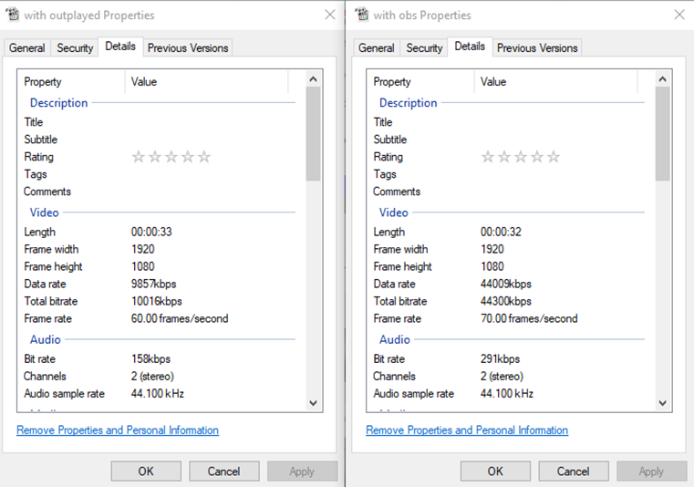
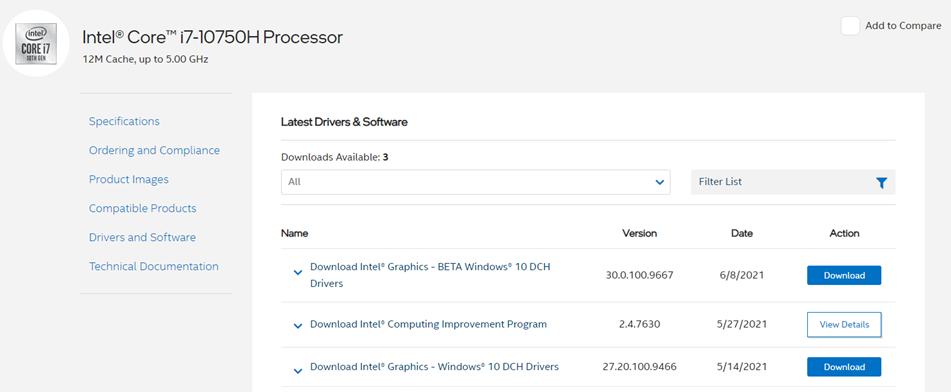

Open Broadcaster Software (OBS) is a free and open-source cross-platform streaming and recording program built with Qt and maintained by the OBS Project. Since 2016, the software is now referred to as OBS Studio.
This is the base of all recording apps on Overwolf.

In the first section of the OBS log you can check the system information such as the CPU, memory, Windows version & build, if the program is being run as Admin and if there is a antivirus or firewall active:

```
10:22:07.823(INFO)[8958]: CPU Name: Intel(R) Core(TM) i7-10750H CPU @ 2.60GHz
10:22:07.823(INFO)[8958]: CPU Speed: 2592MHz
10:22:07.823(INFO)[8958]: Physical Cores: 6, Logical Cores: 12
10:22:07.823(INFO)[8958]: Physical Memory: 16171MB Total, 694MB Free
10:22:07.823(INFO)[8958]: Windows Version: 10.0 Build 19043 (release: 2009; revision: 1110; 64-bit)
10:22:07.823(INFO)[8958]: Running as administrator: false
10:22:07.823(INFO)[8958]: Aero is Enabled (Aero is always on for windows 8 and above)
10:22:07.824(INFO)[8958]: Windows 10 Gaming Features:
10:22:07.824(INFO)[8958]: 	Game DVR: On
10:22:07.824(INFO)[8958]: 	Game Mode: On
10:22:07.826(INFO)[8958]: Sec. Software Status:
10:22:07.827(INFO)[8958]: 	ESET Security: enabled (AV)
10:22:07.827(INFO)[8958]: 	Microsoft Defender Antivirus: disabled (AV)
10:22:07.827(INFO)[8958]: 	ESET Firewall: enabled (FW)
10:22:07.827(INFO)[8958]: 	Windows Firewall: disabled (FW)
```

In this section you can view the available video adapter and settings such as a GPU name, driver version & adapter:

```
10:22:07.830(INFO)[8958]: Initializing D3D11...
10:22:07.830(INFO)[8958]: Available Video Adapters: 
10:22:07.832(INFO)[8958]: 	Adapter 0: NVIDIA GeForce GTX 1650 Ti
10:22:07.832(INFO)[8958]: 	  Dedicated VRAM: 4154458112
10:22:07.832(INFO)[8958]: 	  Shared VRAM:    4183293952
10:22:07.832(INFO)[8958]: 	  PCI ID:         10de:1f95
10:22:07.832(INFO)[8958]: 	  Driver Version: 27.21.14.5763
10:22:07.833(INFO)[8958]: 	  output 0: pos={0, 0}, size={1920, 1080}, attached=true, refresh=60, name=DELL P2419H
10:22:07.833(INFO)[8958]: 	  output 1: pos={-1920, 0}, size={1920, 1080}, attached=true, refresh=60, name=DELL P2419H
10:22:07.833(INFO)[8958]: 	Adapter 1: Intel(R) UHD Graphics
10:22:07.833(INFO)[8958]: 	  Dedicated VRAM: 134217728
10:22:07.833(INFO)[8958]: 	  Shared VRAM:    4183293952
10:22:07.833(INFO)[8958]: 	  PCI ID:         8086:9bc4
10:22:07.833(INFO)[8958]: 	  Driver Version: 26.20.100.7985
10:22:07.833(INFO)[8958]: 	  output 0: pos={1920, 0}, size={1920, 1080}, attached=true, refresh=144, name=
10:22:07.835(INFO)[8958]: Loading up D3D11 on adapter NVIDIA GeForce GTX 1650 Ti (0)
10:22:07.899(INFO)[8958]: D3D11 loaded successfully, feature level used: b000
10:22:07.899(INFO)[8958]: DXGI increase maximum frame latency success
```

In this section you can view the input and output audio devices. These will be either the current system default for the session (If the devices are changed during the session this change will not be saved during the current recording) or the ones manually chosen by the user. You can also check the volume and if the device was disabled:

```
10:22:09.039(INFO)[8958]: [WASAPISource::WASAPISource] Device '{0.0.0.00000000}.{66d4c155-4c0a-435b-bfb1-599df12252e7}' not found.  Waiting for device
10:22:09.039(INFO)[8958]: Create Audio device [Output]: {0.0.0.00000000}.{66d4c155-4c0a-435b-bfb1-599df12252e7}
10:22:09.039(INFO)[8958]: Set output-device volume: 100
10:22:09.040(INFO)[8958]: [WASAPISource::WASAPISource] Device '{0.0.1.00000000}.{b3122eb7-9ca4-410c-9a33-4a54468a3f23}' not found.  Waiting for device
10:22:09.040(INFO)[8958]: Create Audio device [Input]: {0.0.1.00000000}.{b3122eb7-9ca4-410c-9a33-4a54468a3f23}
10:22:09.040(INFO)[8958]: Set input-device volume: 0
10:22:09.040(INFO)[8958]: Set output-device mixer track: 0xc3 (0x3)
10:22:09.040(INFO)[8958]: Set input-device mixer track: 0xc5 (0x5)
10:22:09.040(INFO)[8958]: Separate audio tracks is supported
10:22:09.040(INFO)[8958]: supported audio tracks: 0x7 (3)
```

In this section we will see the recording starting and the recording settings:

```
10:22:16.351(WARNING)[8c3c]: [game-capture: 'OW Game capture'] game capture pause state changed: 0 -> 1
10:22:52.159(INFO)[8958]: Handle command 6 (0)
10:22:52.159(INFO)[8958]: game focus changed: true
10:22:52.159(INFO)[8958]: update sources visibility [1 (1)]
10:22:52.159(INFO)[8958]: Game capture foreground changed: 0 -> 1 (exist: 1 visible:1)
10:22:52.159(INFO)[8958]: Update source |brb| visibility: false
10:22:52.167(WARNING)[8c3c]: [game-capture: 'OW Game capture'] game capture pause state changed: 1 -> 0
10:22:53.886(INFO)[91e4]: [game-capture: 'OW Game capture'] [Game Log]: gl_free: GL error occurred on free: 1282
10:22:53.886(INFO)[91e4]: [game-capture: 'OW Game capture'] [Game Log]: ------------------ gl capture freed ------------------
10:22:54.190(INFO)[8958]: Handle command 6 (0)
10:22:54.190(INFO)[8958]: game focus changed: false
10:22:54.190(INFO)[8958]: update sources visibility [0 (0)]
10:22:54.190(INFO)[8958]: Game capture foreground changed: 1 -> 0 (exist: 1 visible:1)
10:22:54.190(INFO)[8958]: Update source |brb| visibility: true
10:22:54.191(INFO)[8958]: Set BRB image color 0xcc0d0d0d
10:22:54.191(INFO)[8958]: update BRB image position: [x:375 y:311]
10:22:54.201(WARNING)[8c3c]: [game-capture: 'OW Game capture'] game capture pause state changed: 0 -> 1
10:22:54.984(INFO)[8c3c]: [game-capture: 'OW Game capture'] capture window no longer exists, terminating capture
10:22:54.984(INFO)[8c3c]: [game-capture: 'OW Game capture'] capture stopped
10:22:54.984(INFO)[8c3c]: Game source capture state changed: 0 [process alive: true, sli: false]
10:22:54.984(INFO)[8b38]: Game capture state changed [capture:0 process alive:0]
10:22:54.984(INFO)[8b38]: game exit, stopping replay [force:1]
10:22:54.984(INFO)[8b38]: Call stop replay stream
10:22:54.984(INFO)[8b38]: Stop replay buffer [id:2 force: 1]
10:22:54.985(INFO)[8b38]: Replay buffer stopping [id:2]
10:22:54.985(INFO)[8b38]: Stop replay stream
10:22:54.985(INFO)[8b38]: game exit, request to stop recording
10:22:54.985(INFO)[8b38]: Update source |game| visibility: false
10:22:54.985(INFO)[8b38]: stop recording: no game source
10:22:54.985(INFO)[8b38]: Call stopping recoding stream
10:22:54.985(INFO)[8b38]: record stopping [id:1]
10:22:54.985(INFO)[8b38]: Stopping recoding stream
10:22:54.985(INFO)[8b38]: remove game source
10:22:54.986(INFO)[65c0]: Output 'ReplayBuffer': stopping
10:22:54.986(INFO)[65c0]: Output 'ReplayBuffer': Total frames output: 2576
10:22:54.986(INFO)[65c0]: Output 'ReplayBuffer': Total drawn frames: 2585
10:22:54.986(INFO)[65c0]: Replay buffer stopped [id:2]. code:0
10:22:55.160(INFO)[65c0]: On video split [id:1]. path: C:\Users\Shirel laptop\Videos\Overwolf\Outplayed\tmp\Minecraft 07-20-2021_10-22-07-714.mp4 duration: 43050
10:22:55.160(INFO)[65c0]: new split video created: C:\Users\Shirel laptop\Videos\Overwolf\Outplayed\tmp\Minecraft 07-20-2021_10-22-07-714.mp4 duration: 43050
10:22:55.160(INFO)[65c0]: [ffmpeg muxer: 'Overwolf Output'] Output of file 'C:\Users\Shirel laptop\Videos\Overwolf\Outplayed\tmp\Minecraft 07-20-2021_10-22-07-714.mp4' stopped
10:22:55.160(INFO)[65c0]: Output 'Overwolf Output': stopping
10:22:55.160(INFO)[65c0]: Output 'Overwolf Output': Total frames output: 2586
10:22:55.160(INFO)[65c0]: Output 'Overwolf Output': Total drawn frames: 2595
10:22:55.160(INFO)[65c0]: recording stopped [id:1]
10:22:55.160(INFO)[65c0]: recording stopped [id:1 code:0 error:(null)]
10:22:55.160(INFO)[4650]: Video stopped, number of skipped frames due to encoding lag: 8/2593 (0.3%)
10:22:55.161(INFO)[8958]: shut down command
10:22:55.162(INFO)[8cb4]: releasing obs
10:22:55.162(INFO)[8cb4]: releasing scene
10:22:55.229(INFO)[8cb4]: [game-capture: 'OW Game capture'] game_capture_destroy
10:22:55.230(INFO)[8cb4]: Freeing OBS context data
10:22:55.230(INFO)[8cb4]: 	1 encoder(s) were remaining
10:22:55.256(INFO)[8cb4]: Number of memory leaks: 144
```

## Recording issues checklist

When investigating recording issues check:

* Make sure that the user follows the troubleshooting steps in the Common [Capture Issues](https://support.overwolf.com/en/support/solutions/articles/9000181387-common-capture-issues) article.

* Go through OBS logs and check for errors such as the users devices not being recognized or out of date, high resource usage (Such as CPU, RAM or GPU) or encoding errors.

* Check in Trace Logs or OBS logs if hardware accelerated GPU is enabled. This will appear as "OS: HAGSEnable: True". If it is enabled ask the user to disable it using this guide: https://support.overwolf.com/en/support/solutions/articles/9000183412-visual-artifacts-in-overwolf-apps-hardware-acceleration- 

* In order to test if the issue is related to the app or the user's computer settings you can ask them to try recording in OBS studio to check that they can record correctly. You can send the following canned comment:

```text
Can you please try recording with OBS Studio and let me know if the same issue occurs?
You can get OBS Studio for free here: https://obsproject.com/.  

If the issue persists when the users records using OBS Studios this indicates that the issue is related to their system and not to Overwolf or any Overwolf app.
```

* Check supported video encoders in OBS, make sure they are not using x264 which uses CPU (When drivers are not up to date we’ll see a message that encoder unavailable).
* Reasons why they might use x264:
  * User defined encoder themselves in setting.
  * OW OBS used it as a fallback due to issues with other encoders.
  * Other encoders not recognized (Check trace to see if we recognize any other encoders).
* Check in the DxDiag logs that the user has enough free resources for recording.

## Audio issues checklist

When investigating audio issues check:

* Verify if the user is having an issue with recording output sounds (Game sounds/discord) / Input (microphone) or both ?
Turn off the mic and try to record/ turn off the sound and try to record

* Make sure that the user follows the troubleshooting steps in the [Common Capture Issues article](https://support.overwolf.com/en/support/solutions/articles/9000181387-common-capture-issues). 

* Check which audio devices are set as default. Make sure that these settings match across the Overwolf sound settings, your app sound settings and the computer sound settings.

* If the user has more than one audio device check with them that they aren't switching them mid game. 
Overwolf can not recognize a switch in audio devices once it has been started up. If the user would like to update their audio settings they will need to restart Overwolf and the game in order for the changes to apply.

* Delays in sound- ask the user to record the same clip in your app and in OBS Studio and send you the recording files. Compare the properties of each file to check if they are recorded in a different framerate or bitrate



Note that currently it is not possible to only record certain channels (Such as only recording input from Discord and not other active sound sources).

## How to check if the drivers are up to date

You can find the details regarding the driver the user is using in both the OBS log files and in the DxDiag. We recommend checking these details according to the OBS as the DxDiag may not always be the most up to date.

These are the methods to check each of the drivers:

### AMD

AMD usually updates monthly, however, not all cards will get the update (Such as if the user is using an older card).
In order to check if the user is on the most up to date version copy the number next to the Driver Version (For example: “ Driver Version: 27.20.20903.8001”) and google the driver number. You will reach the AMD release notes connect to a version name and release note that corresponds to the month. 

In the following image the version was released in May:


### Intel

In order to check if an Intel driver is up to date copy the processor model and google it. You will then be able to view the latest drivers available and compre with the users current driver: 



### Nvidia

Nvidia does not update frequently. To check if the user is using the most up to date version look at their version number and take note of the last 5 numbers, then go to the Nvidia website [Hyperlink: https://www.nvidia.com/Download/index.aspx ] to look up the graphic card and compare the version numbers. 


